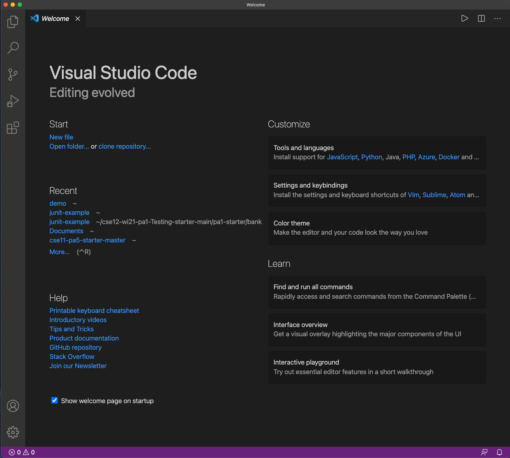
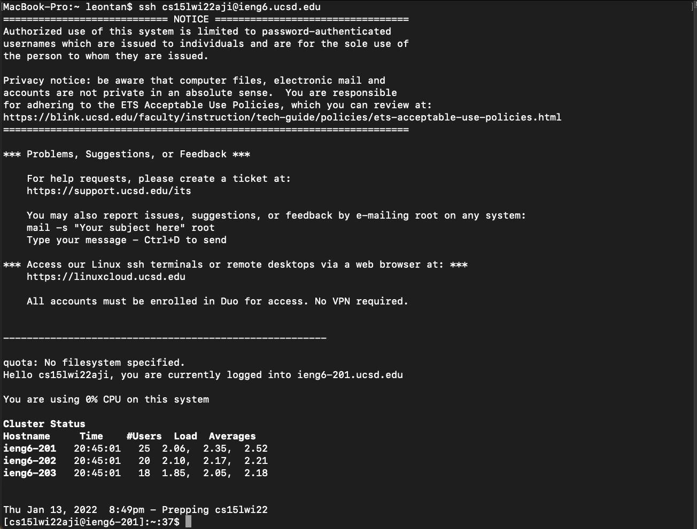
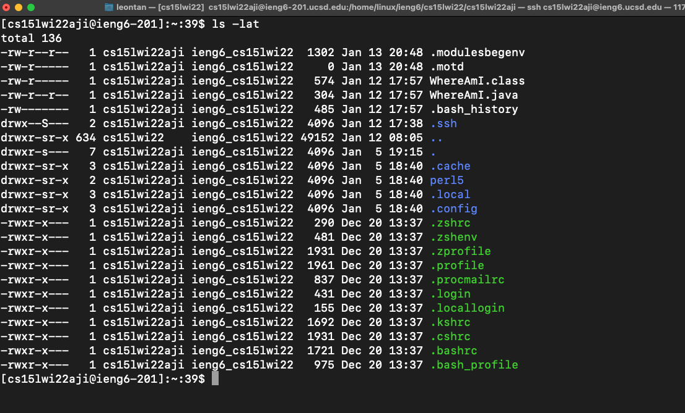
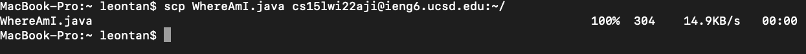
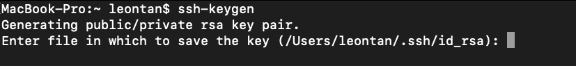
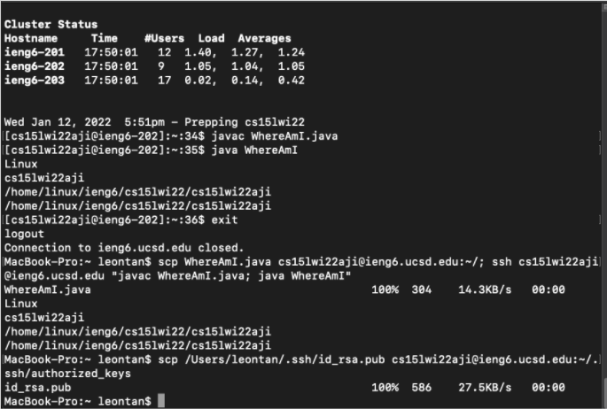

# Lab Report 1 

## Part 1: Installing Visual Studio Code

First, go to Visual Studio code and use the url given here [https://code.visualstudio.com/](https://code.visualstudio.com/)

Please download VS code with your respective platform (ex. Mac, Window, etc)

## Part 2: Remotely Connecting

First, look up your 15L account using the link [here](https://sdacs.ucsd.edu/~icc/index.php). If this is your first time accessing the link, you should also change the password. After, open a terminal in VS Code and put the following command: 
ssh <account>@ieng6.ucsd.edu

## Part 3: Trying Some Commands

There are lots of terminal commands that you can test yourself! Some of these include `cd`, `ls`, `pwd`, `mkdir`, and `cp`. An example running the **ls -lat** command is found below

## Part 4: Moving Files with scp

Another way we can move files from our client to the server is by using a command called scp. After creating a file called WhereAmI.java, use the command: 

scp WhereAmI.java <account>@ieng.ucsd.edu

This is what it should look like if done correctly:

## Part 5: Setting an SSH Key

To solve the problem of always having to type a password, we will be using a ssh key. To generate a public and private key, use the **ssh-keygen** command. It should look something like this:

Now save the file as **/Users/<user>/.ssh/id_rsa**. Now make a .ssh directory by using the command mkdir .ssh. After, log out and run this command: **scp /Users//.ssh/id_rsa.pub @ieng6.ucsd.edu:~/.ssh/authorized_keys** 

Now you should be able to access the server without typing the password. 

## Part 6: Optimizing Remote Running

Although we can log in and out with a password, there is a way to login while running only one command. To do this, we can run a single command like this: **Scp src/*.java <username>@<serverdomain>:~/ && ssh <username>@<serverdomain> “javac *.java && java <main>.class *.class”** 
The following is an example: 

