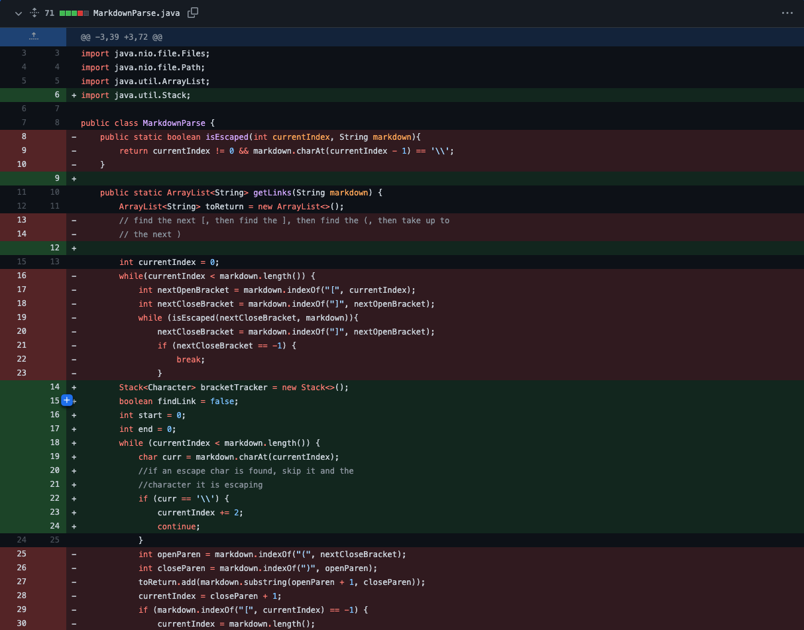
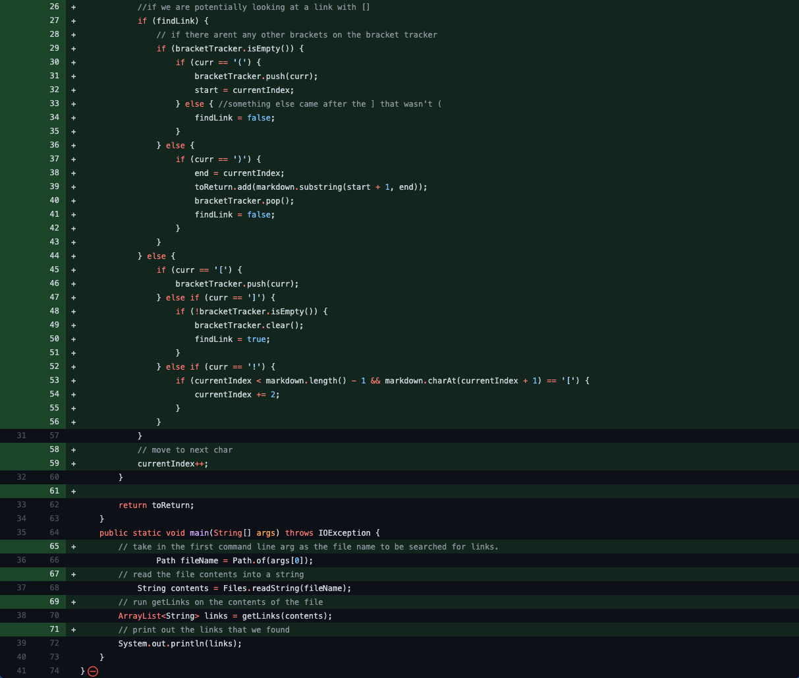
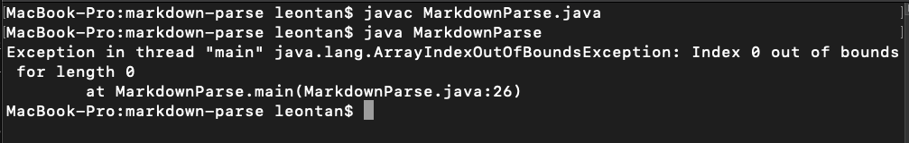

# Lab Report 2: Bugs and Symptoms

## Text after the last link
In this test file, a bug appears after running the command: java MarkdownParse test-file2.md.

The following symptom took around 30 seconds to appear, resulting in the exception:

 
## Link to the test file for a failure-inducing input that prompted you to make that change

[Test file for Failure inducing input](https://github.com/JessalynWang/markdown-parse/blob/main/MarkdownParseTest.java)

Symptom of the failure-inducing input running in command line: 

## What is the relationship between the bug, the symptom, and the failure-inducing input?**

The sympton: A complilation error that says "Index 0 out of bounds for length 0"

The bug: Our previous program could not read a link that potentially contained a link with multiple brackets []. This is because in our previous iteration of MarkdownParse, our implementation of the `isEscaped` method would return an index of 0 while manaully searching for another bracket, but would fail if the input contained more brackets. To fix this, our group implemented a stack and utilized the class' built in methods to solve the symptom.

