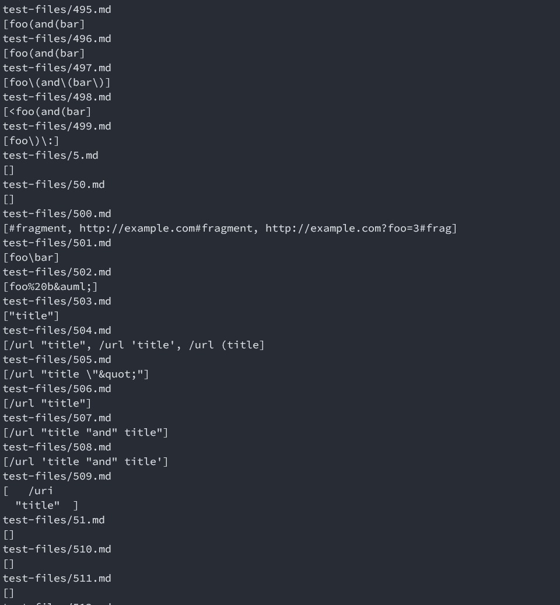
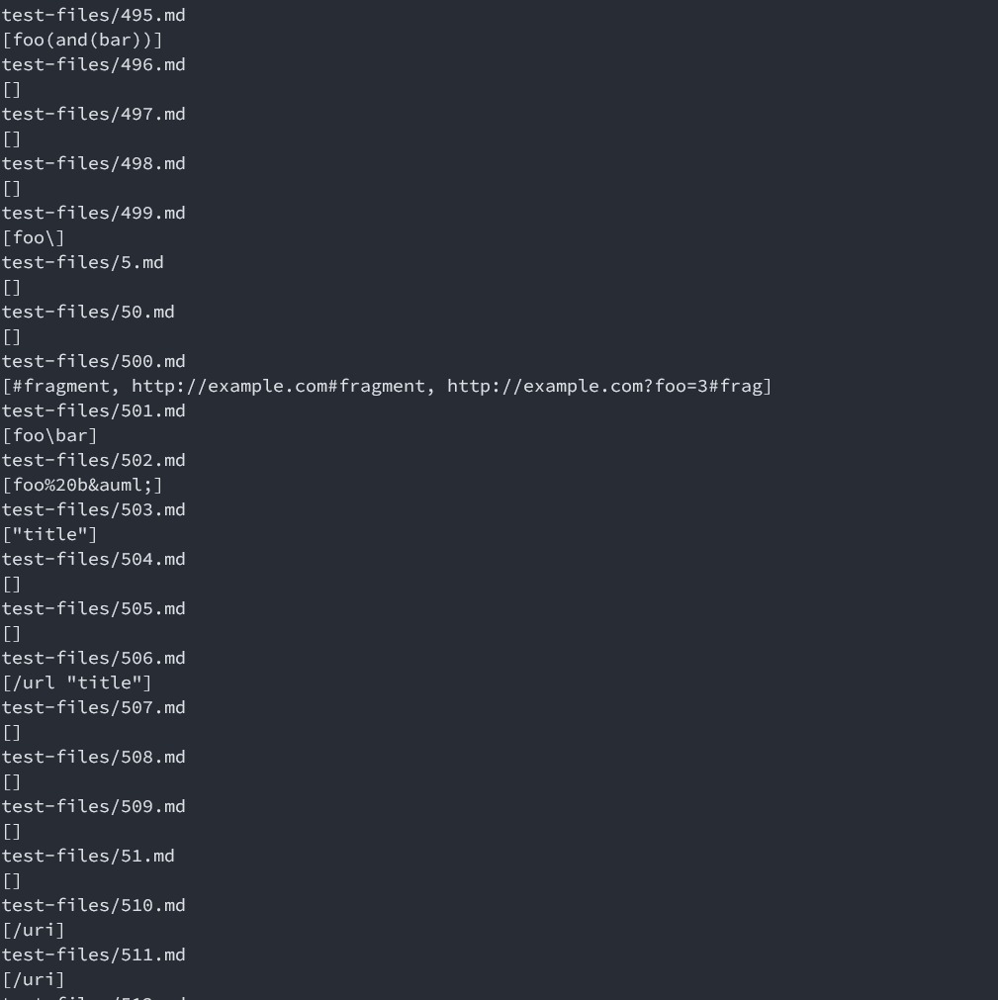

# Lab Report 5

## Part 1: Comparing my implementation with Joe's

First, I changed the makefile to add compile instructions to my own markdown-parse programmed. 
After this, I ran the `bash script.sh > script.out` command on both the my own, as well as Joe's implementation of markdownparse. 

## Part 2: How I found tests with different results 

To compare the two out files, I used `$ diff script.out script-leon.out`

Actual outputs of Joe's implementation:

Actual outputs of my implementation:

Noticed two things: 
	
	- there are lots of different output
	
	- picked two tests with diff output: 495.md and 511.md

## Part 3: Describe which implementation is correct and wrong 

A. 495.md
> % cat test-files/495.md
	[link](foo(and(bar)))
	% java MarkdownParse test-files/495.md
	[foo(and(bar))]
	% java MarkdownParseLeon test-files/495.md
	[foo(and(bar]

	The correct answer is '[foo(and(bar))]'. My program ate the last '))'. 

	The code at line 59 is wrong. When it is parsing (foo(and(bar))), and 
	it encounters the first ')', it drops out of the findLink state by
	setting findLink to false. It should exit the findLink state only 
	when it reads the last ')'.

B. 511.md
>  % cat test-files/511.md
	[link [foo [bar]]](/uri)
	% java MarkdownParse test-files/511.md
	[/uri]
	% java MarkdownParseLeon test-files/511.md
	[]
   
	The correct answer is '[/uri]'. My program returned '[]'.

	The code at line 67 is wrong. The code implemented a bracket tracker, where
	a [ is pushed onto the bracket tracker (which is stack), and should be
	popped when a corresponding ] is encountered. Instead, the current code just
	clear bracket tracker. So it is not able to handle more than one level of [].

